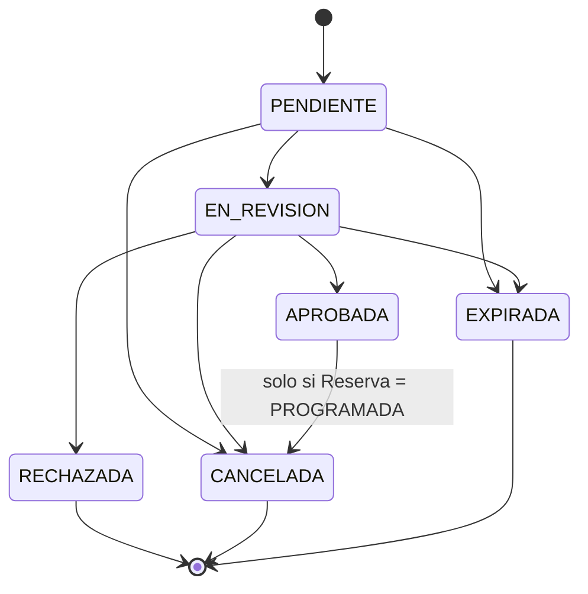
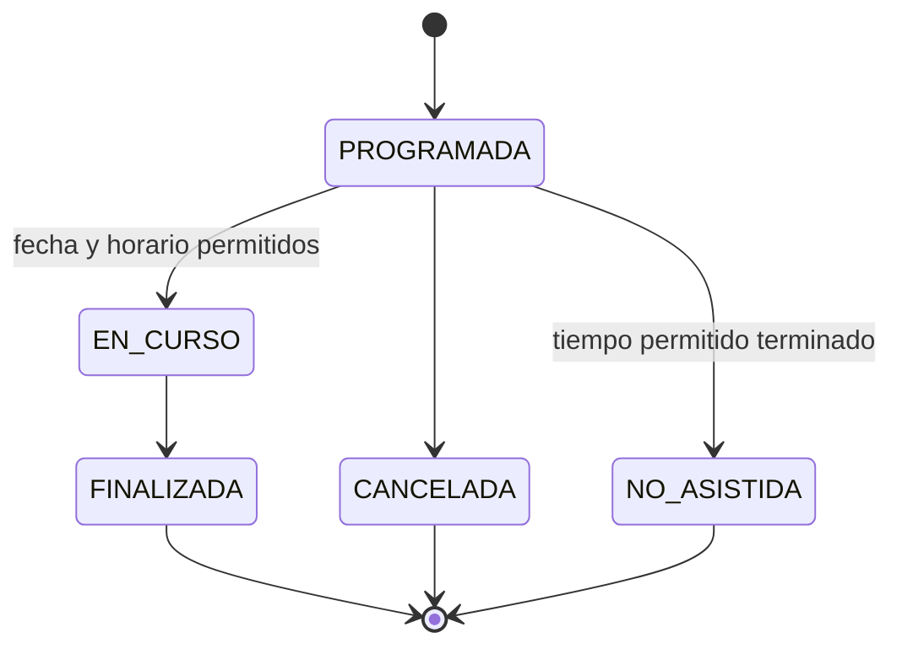

# Máquina de estados de reservas-solicitudes-service

## 1. Objetivo y alcance

Este documento define las máquinas de estados de `SolicitudReserva` y `Reserva`, las transiciones válidas, sus guardas y las acciones que deben ejecutarse. También establece la coordinación transaccional entre la aprobación o cancelación de una solicitud y su reserva asociada.

La definición es conceptual y corresponde únicamente al paso 2. No incluye enums Java, entidades, servicios, controladores, SQL ni configuración.

## 2. Máquina de estados de SolicitudReserva

### 2.1. Estados

| Estado | Descripción |
|---|---|
| `PENDIENTE` | Estado inicial. La solicitud fue registrada y espera que un usuario autorizado inicie su revisión. Todavía no existe una reserva derivada de ella. |
| `EN_REVISION` | La solicitud está siendo evaluada. En este estado puede aprobarse, rechazarse, cancelarse o expirar. |
| `APROBADA` | La solicitud fue aceptada y produjo exactamente una `Reserva` en estado `PROGRAMADA`. No es un estado completamente final: puede pasar a `CANCELADA` mientras la reserva asociada continúe `PROGRAMADA`. |
| `RECHAZADA` | Estado final. La solicitud no fue aceptada y no puede generar una reserva ni reactivarse. |
| `CANCELADA` | Estado final. La solicitud fue retirada o anulada y no puede reactivarse. Si antes estaba aprobada, su reserva programada también queda cancelada. |
| `EXPIRADA` | Estado final. La solicitud perdió vigencia sin resolverse y no puede reactivarse. |

El estado inicial obligatorio es `PENDIENTE`. Los estados finales son `RECHAZADA`, `CANCELADA` y `EXPIRADA`.

### 2.2. Transiciones permitidas

| Origen | Destino | Condiciones o guardas | Acción ejecutada |
|---|---|---|---|
| `PENDIENTE` | `EN_REVISION` | La solicitud existe, continúa en `PENDIENTE` y el usuario tiene permiso para revisarla. | Cambiar el estado a `EN_REVISION`, actualizar las marcas de auditoría y registrar la transición en `HistorialSolicitud`. |
| `PENDIENTE` | `CANCELADA` | La solicitud existe, continúa en `PENDIENTE` y el usuario puede cancelarla. | Cambiar el estado a `CANCELADA`, guardar el motivo o comentario y crear el historial. No existe una reserva que cancelar. |
| `PENDIENTE` | `EXPIRADA` | La solicitud existe, continúa en `PENDIENTE` y se cumple la regla temporal de expiración. | Cambiar el estado a `EXPIRADA`, registrar la causa temporal y crear el historial. |
| `EN_REVISION` | `APROBADA` | La solicitud existe y continúa en `EN_REVISION`; el usuario puede aprobar; satisface las reglas de reserva; la franja está disponible; no existe una reserva para la solicitud. | Cambiar la solicitud a `APROBADA`, crear exactamente una `Reserva` en `PROGRAMADA` y registrar el historial. Todo ocurre en una misma transacción local. |
| `EN_REVISION` | `RECHAZADA` | La solicitud existe, continúa en `EN_REVISION`, el usuario puede rechazarla y se proporciona la justificación exigida por la regla de negocio. | Cambiar el estado a `RECHAZADA`, conservar la justificación y crear el historial. No se crea ninguna reserva. |
| `EN_REVISION` | `CANCELADA` | La solicitud existe, continúa en `EN_REVISION` y el usuario puede cancelarla. | Cambiar el estado a `CANCELADA`, guardar el motivo o comentario y crear el historial. No existe una reserva aprobada que cancelar. |
| `EN_REVISION` | `EXPIRADA` | La solicitud existe, continúa en `EN_REVISION` y se cumple la regla temporal de expiración. | Cambiar el estado a `EXPIRADA`, registrar la causa temporal y crear el historial. |
| `APROBADA` | `CANCELADA` | La solicitud existe y continúa `APROBADA`; su única reserva asociada existe y continúa `PROGRAMADA`; el usuario puede cancelar. La transición está prohibida si la reserva está `EN_CURSO`, `FINALIZADA` o en cualquier estado distinto de `PROGRAMADA`. | Cambiar la solicitud y la reserva a `CANCELADA` en la misma transacción local, actualizar sus datos de auditoría y crear el historial de la solicitud. |

### 2.3. Reglas y transiciones prohibidas

- Una solicitud solo puede aprobarse desde `EN_REVISION`.
- Una solicitud no puede aprobarse dos veces. Si ya está `APROBADA` o si ya existe su reserva, un nuevo intento de aprobación no debe crear otra reserva y debe responder `409 Conflict`.
- Una solicitud `RECHAZADA` no puede aprobarse, generar una reserva ni cambiar nuevamente de estado.
- Una solicitud `CANCELADA` o `EXPIRADA` no puede reactivarse ni cambiar nuevamente de estado.
- No se permite `PENDIENTE -> APROBADA`; primero debe pasar por `EN_REVISION`.
- No se permite regresar de `EN_REVISION` a `PENDIENTE`.
- `APROBADA` no puede pasar a `RECHAZADA`, `EXPIRADA` ni `EN_REVISION`.
- `APROBADA -> CANCELADA` está prohibida cuando la reserva asociada está `EN_CURSO`, `FINALIZADA`, `CANCELADA` o `NO_ASISTIDA`. Solo se admite si continúa `PROGRAMADA`.
- La ausencia de la reserva asociada a una solicitud `APROBADA`, o la existencia de más de una, representa una inconsistencia del dominio y no habilita una transición alternativa.
- Toda transición no incluida expresamente en la tabla debe responder `409 Conflict`.

### 2.4. Diagrama de SolicitudReserva

`APROBADA` no se conecta directamente con un estado final del diagrama porque mantiene una salida condicional hacia `CANCELADA` mientras la reserva no haya iniciado.

## 3. Máquina de estados de Reserva

### 3.1. Estados

| Estado | Descripción |
|---|---|
| `PROGRAMADA` | Estado inicial. La reserva fue creada al aprobar una solicitud y está prevista para una fecha y franja horaria futuras o vigentes. |
| `EN_CURSO` | La utilización del laboratorio comenzó dentro de la fecha y el horario permitidos. |
| `FINALIZADA` | Estado final. La utilización que estaba en curso concluyó. |
| `CANCELADA` | Estado final. La reserva fue anulada antes de comenzar. |
| `NO_ASISTIDA` | Estado final. La franja permitida terminó sin que la reserva hubiera iniciado. |

El estado inicial obligatorio es `PROGRAMADA`. Los estados finales son `FINALIZADA`, `CANCELADA` y `NO_ASISTIDA`.

### 3.2. Transiciones permitidas

| Origen | Destino | Condiciones o guardas | Acción ejecutada |
|---|---|---|---|
| `PROGRAMADA` | `EN_CURSO` | La reserva existe, continúa `PROGRAMADA`, el usuario puede iniciarla y la fecha y hora actuales se encuentran dentro del intervalo permitido para iniciar. | Cambiar el estado a `EN_CURSO` y actualizar las marcas de auditoría. |
| `PROGRAMADA` | `CANCELADA` | La reserva existe, continúa `PROGRAMADA`, todavía no ha iniciado y el usuario puede cancelarla. Debe validarse la versión para evitar una cancelación concurrente. | Cambiar el estado a `CANCELADA`, actualizar las marcas de auditoría y, cuando la cancelación se origina en una solicitud aprobada, cancelar también esa solicitud en la misma transacción. |
| `PROGRAMADA` | `NO_ASISTIDA` | La reserva existe, continúa `PROGRAMADA` y terminó el tiempo permitido sin que haya iniciado. | Cambiar el estado a `NO_ASISTIDA` y actualizar las marcas de auditoría. |
| `EN_CURSO` | `FINALIZADA` | La reserva existe, continúa `EN_CURSO`, el usuario puede finalizarla y se satisface la regla temporal aplicable para el cierre. | Cambiar el estado a `FINALIZADA` y actualizar las marcas de auditoría. |

### 3.3. Reglas, idempotencia y transiciones prohibidas

- Una reserva solo puede iniciar desde `PROGRAMADA` y cuando haya llegado su fecha y horario permitido.
- No se permite `PROGRAMADA -> FINALIZADA`; una reserva debe estar primero `EN_CURSO`.
- Una reserva no puede finalizar si no está `EN_CURSO`.
- No se permite cancelar una reserva `EN_CURSO` o `FINALIZADA` mediante esta máquina de estados.
- `NO_ASISTIDA` solo puede establecerse desde `PROGRAMADA` una vez terminado el tiempo permitido sin inicio.
- Una reserva `CANCELADA`, `FINALIZADA` o `NO_ASISTIDA` no puede cambiar nuevamente de estado.
- Toda transición no incluida expresamente en la tabla debe responder `409 Conflict`.
- La cancelación concurrente se controla con el campo `version` mediante versionado optimista. Si otra operación modificó la reserva con la misma versión esperada, la operación que pierde la carrera no puede sobrescribir el estado vigente.
- Las operaciones de iniciar, finalizar y cancelar son idempotentes: repetir la misma operación sobre un recurso que ya alcanzó el estado objetivo devuelve el resultado vigente sin ejecutar otra transición ni duplicar efectos. Esta repetición exitosa no crea nuevos efectos de auditoría. Intentar una operación diferente e incompatible con el estado actual continúa siendo una transición inválida y responde `409 Conflict`.

### 3.4. Diagrama de Reserva

## 4. Coordinación entre SolicitudReserva y Reserva

### 4.1. Aprobación y creación de la reserva

La transición `SolicitudReserva: EN_REVISION -> APROBADA` y la creación de su `Reserva` son una única operación de negocio y deben ejecutarse en la misma transacción local del microservicio.

La operación debe cumplir estas invariantes:

1. La solicitud continúa en `EN_REVISION` y satisface todas las guardas de aprobación.
2. No existe previamente una reserva asociada con su `solicitudId`.
3. Se crea exactamente una reserva cuyo estado inicial es `PROGRAMADA`.
4. La solicitud cambia a `APROBADA`.
5. Se registra la transición en `HistorialSolicitud`.
6. Todos los cambios se confirman juntos; si falla cualquiera de ellos, se revierte la operación completa.

Así se evita una solicitud aprobada sin reserva y también la creación de reservas duplicadas. Un intento posterior de aprobación no repite la operación y responde `409 Conflict`.

### 4.2. Cancelación de una solicitud aprobada

La transición `SolicitudReserva: APROBADA -> CANCELADA` requiere que su reserva asociada esté todavía `PROGRAMADA`. La solicitud y la reserva deben cambiar a `CANCELADA` en una misma transacción local.

Antes de realizarla se comprueban el estado y la versión vigentes de ambos recursos. Si la reserva comenzó concurrentemente y ya está `EN_CURSO`, o si está `FINALIZADA`, la guarda falla, no se modifica ninguno de los dos recursos y la respuesta es `409 Conflict`. La misma restricción se aplica si la reserva ya se encuentra en otro estado final.

La cancelación directa de una reserva perteneciente a una solicitud aprobada debe mantener la coherencia del agregado: al cancelar la reserva `PROGRAMADA`, la solicitud asociada también pasa a `CANCELADA` dentro de la misma transacción. De esta forma no queda una solicitud `APROBADA` cuya reserva esté `CANCELADA`.

## 5. Uso de HistorialSolicitud

Cada transición real de `SolicitudReserva` debe crear exactamente un registro `HistorialSolicitud` dentro de la misma transacción que actualiza la solicitud. El registro conserva:

- La solicitud mediante `solicitudId`.
- El estado anterior y el estado nuevo.
- El usuario que ejecutó la acción mediante `usuarioAccionId`.
- El comentario, motivo o justificación disponible.
- El instante exacto de la transición mediante `fechaHora`.

Si la actualización de estado o la creación del historial falla, toda la transición debe revertirse. Una transición rechazada no crea historial porque no produjo un cambio de estado. Del mismo modo, la repetición idempotente de una operación de reserva que ya alcanzó su estado objetivo no representa una nueva transición y no duplica efectos.

`HistorialSolicitud` registra el ciclo de vida de la solicitud. Este modelo no añade en el paso 2 una entidad independiente de historial para `Reserva`; los cambios coordinados con la solicitud se explican mediante el registro de la transición de esta última y las marcas de auditoría de la reserva.

## 6. Respuestas HTTP esperadas

| Código | Uso esperado |
|---|---|
| `200 OK` | La transición se ejecutó correctamente. También puede utilizarse al repetir una operación idempotente de iniciar, finalizar o cancelar que ya alcanzó exactamente el estado solicitado, sin duplicar efectos. |
| `403 Forbidden` | El usuario está autenticado, pero no tiene permiso para ejecutar la transición solicitada. |
| `404 Not Found` | La solicitud o reserva indicada no existe. |
| `409 Conflict` | El estado actual no admite la transición, falla una guarda de negocio, existe una aprobación o reserva duplicada, o se detecta un conflicto de versión concurrente. |

La evaluación debe distinguir la inexistencia del recurso (`404`), la falta de autorización (`403`) y el conflicto con el estado vigente o las reglas de transición (`409`). Ninguna respuesta de error debe producir cambios parciales ni registros de historial de una transición que no ocurrió.
